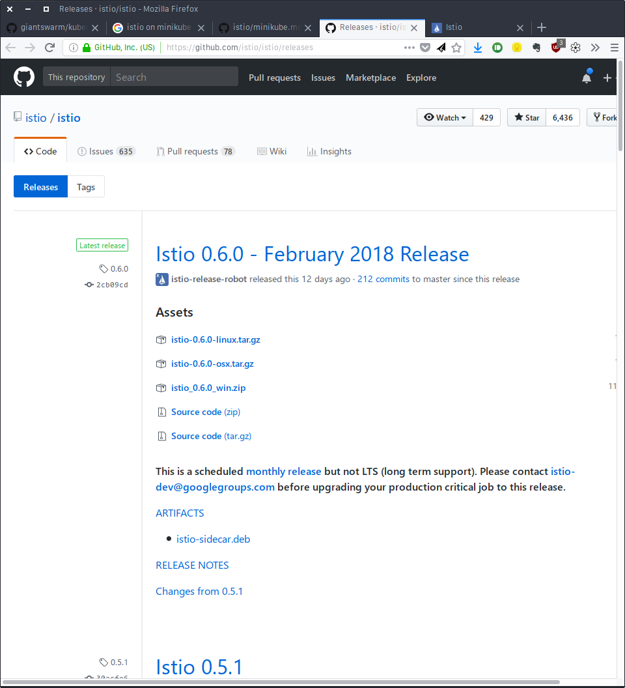
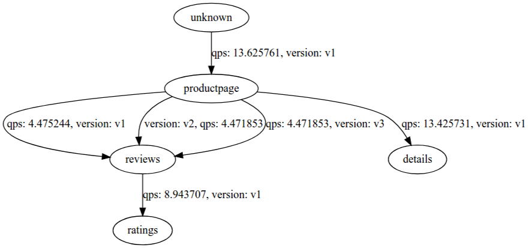

## Istio (An open platform to connect,manage,and secure microservices)


### Installation
macOS 또는 Linux 사용자는 
```sh
curl -L https://git.io/getIstio | sh -
```
또는 
http://github.com/istio/istio/releases 에서 환경에 맞는 istio를 다운로드 한다.


압축을 풀고, bin/istioctl은 환경설정 PATH에 추가한다

<!-- ### Minikube 준비
istio를 사용하기 위해서는, CRD, RBAC과 Initializers를 Enable시켜야 한다

- CRD (custom resource definition) : K8s 1.7+
- RBAC (roles, bindins) : K8s 1.8+ / minikube에서는 기본으로 enable되어 있지 않기 때문에 enable시켜줘야 한다

Istio sidecar auto injection : Initializer concept in K8s를 사용한다. Initializer는 Alpha feature로 기본적으로 disable되어 있다.

```sh
minikube start \
  --feature-gates=CustomResourceValidation=true \
  --extra-config=apiserver.authorization-mode=RBAC \
  --extra-config=controller-manager.ClusterSigningCertFile="/var/lib/localkube/certs/ca.crt" \
	--extra-config=controller-manager.ClusterSigningKeyFile="/var/lib/localkube/certs/ca.key" \
	--extra-config=apiserver.Admission.PluginNames=NamespaceLifecycle,LimitRanger,ServiceAccount,PersistentVolumeLabel,DefaultStorageClass,DefaultTolerationSeconds,MutatingAdmissionWebhook,ValidatingAdmissionWebhook,ResourceQuota \
	--kubernetes-version=v1.9.0
``` -->

### Istio 설정
download받은 istio파일의 install/kubernetes/istio.yaml을 적용한다.  (실 운영환경에서는 istio-auth.yaml 권장 - 네임스페이스에 CA를 디플로이하고 서비스간에 mTLS를 이용한 통신을 가능하게 한다.)
```sh
kubectl apply -f install/kubernetes/istio.yaml
```


<!-- 
**istio sidecar auto inject**
```bash
kubectl label namespace <namespace> istio-injection=enabled
``` -->
minikube에서는 LoadBalancer를 지원하지 않기 때문에, istio-ingress는 "pending"상태이다. istio-ingress를 사용하기 위해서 여기서는 "LoadBalancer --> NodePort"로 변경해 준다.


#### the Metrics collection
```sh
kubectl apply -f install/kubernetes/addons/prometheus.yaml
kubectl apply -f install/kubernetes/addons/grafana.yaml
kubectl apply -f install/kubernetes/addons/servicegraph.yaml
kubectl apply -f install/kubernetes/addons/zipkin.yaml
```

##### the Grafana dashboard
```sh
kubectl port-forward $(kubectl get pod -l app=grafana -o jsonpath='{.items[0].metadata.name}' -n istio-system) 3000:3000 -n istio-system
```
http://localhost:3000/dashboard/db/istio-dashboard 에 접속한다.


minikube이 아니라 실제 K8s Cluster에서 LoadBalancer를 사용하는 경우, externalIP로 바로 접속하면 된다
```sh
kubectl get svc grafana -n istio-system
```
##### the ServiceGraph service
클러스터내에서 서비스간의 상호관계를 graphical visulization으로 보여준다.
```sh
kubectl port-forward $(kubectl get pod -l app=servicegraph -o jsonpath='{.items[0].metadata.name}' -n istio-system) 8088:8088 -n istio-system
```


##### Enabling distribued request tracing with Zipkin


### Istio Sample Program - bookinfo

```sh
kubectl apply -f <(istioctl kube-inject -f samples/bookinfo/kube/bookinfo.yaml)
```


minikube에서는 
```sh
export GATEWAY_URL=$(kubectl get po -l istio=ingress -n istio-system -o 'jsonpath={.items[0].status.hostIP}'):$(kubectl get svc istio-ingress -n istio-system -o 'jsonpath={.spec.ports[0].nodePort}')
echo $GATEWAY_URL
curl -o /dev/null -sS -w "%{http_code}" http://192.168.99.100:30881/productpage
```

or

웹페이지 접속 http://192.168.99.100:30881/productpage 

#### route rule with version
기본으로 review 세가지 버전이 번갈아 가면서 나오나, 아래오 같이 조정한다.

[route-rule-reviews-v3.yaml]
```yaml
apiVersion: config.istio.io/v1alpha2
kind: RouteRule
metadata:
  name: reviews-default
spec:
  destination:
    name: reviews
  precedence: 1
  route:
  - labels:
      version: v3
    weight: 100
```
v3으로 routing rule을 100% 준다.
```sh
istioctl create -f samples/kube/route-rules-reviews-v3.yaml
```


#### route rule with user burr
[route-rule-reviews-burr-v3.yaml]
```yaml
apiversion: config.istio.io/v1alpha2
kind: RouteRule
metadata:
  name: reviews-default
spec:
  destination:
    name: reviews
  match:
    httpHeaders:
      cookie:
        regex: ^(.*?;)?(user=burr)(;.*)?$
  percendence: 2
  route:
  - labels:
      version: v3
```
```sh
istioctl create -f route-rule-reviews-burr-v3.yaml
```

### Sock-shop cart
Sock-shop의 Cart부분을 git clone한다.
```sh
git clone https://github.com/microservices-demo/orders.git
```

/src/main/java/works/weave/socks/orders/controllers/OrdersController.java

return값을 1000F로 수정한다.

#### Build
##### Java
jar패키지를 생성한다.
```sh
mvn -DskipTests package
```
##### Docker
<!-- ```sh
GROUP=weaveworksdemos COMMIT=test ./scripts/build.sh
``` -->
docker이미지를 바로 minikube kubernetes cluster의 host에 생성하기 위해서 docker 환경설정을 한다.
```sh
eval $(minikube docker-env)
```


<!-- 
##### Run
```sh
mvn spring-boot:run
```
##### Check
```sh
curl http://localhost:8081/health
```
##### Use
```sh
curl http://localhost:8081
```
##### Push
```sh
GROUP=weaveworksdemos COMMIT=test ./scripts/push.sh
``` -->

##### Deploy to K8s
[](orders-test.yaml)
```yaml
apiVersion: extensions/v1beta1
kind: Deployment
metadata:
  name: orders-v2
  namespace: sock-shop
spec:
  replicas: 1
  template:
    metadata:
      labels:
        name: orders
        version: v2
    spec:
      containers:
      - name: orders
        image: namoo4u/orders
        imagePullPolicy: IfNotPresent
        env:
         - name: ZIPKIN
           value: zipkin.jaeger.svc.cluster.local
         - name: JAVA_OPTS
           value: -Xms64m -Xmx128m -XX:PermSize=32m -XX:MaxPermSize=64m -XX:+UseG1GC -Djava.security.egd=file:/dev/urandom
        ports:
        - containerPort: 80
        securityContext:
          runAsNonRoot: true
          runAsUser: 10001
          capabilities:
            drop:
              - all
            add:
              - NET_BIND_SERVICE
          readOnlyRootFilesystem: true
        volumeMounts:
        - mountPath: /tmp
          name: tmp-volume
        livenessProbe:
          httpGet:
            path: /health
            port: 80
          initialDelaySeconds: 300
          periodSeconds: 3
        readinessProbe:
          httpGet:
            path: /health
            port: 80
          initialDelaySeconds: 180
          periodSeconds: 3
      volumes:
        - name: tmp-volume
          emptyDir:
            medium: Memory
      nodeSelector:
        beta.kubernetes.io/os: linux
```


```sh
kubectl get pod order-v2 -n sock-shop -o yaml | kubectl replace --force -f -
```


```sh
kubectl delete -f deploy/kubernetes/manifests/sock-shop-ns.yaml
kubectl apply -f manifests/sock-shop-ns.yaml
kubectl apply -f <(istioctl kube-inject -f complete-demo.yaml)
```

istio route rule
[route-rule-sock-shop-orders.yaml]
```yaml
metadata:
  name: my-rule
  namespace: sock-shop
spec:
  destination:
    name: orders
  route:
  - labels:
      version: v2
    weight: 50
  - labels:
      version: v1
    weight: 50
```

```sh
istioctl apply -f route-rule-sock-shop-orders.yaml
```