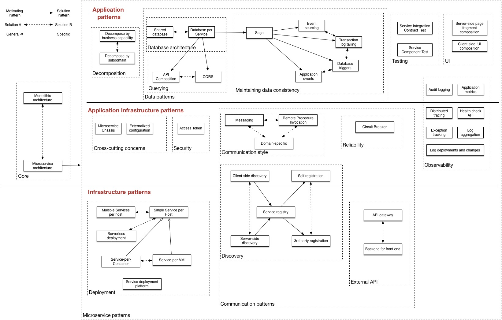

## Sock Shop : A Microservice Demo Application

이 응용 프로그램은 양말을 판매하는 온라인 상점의 사용자 인터페이스 부분입니다. Microservice 와 Cloud Native 기술 데모 및 테스트를 돕기위한 것으로, WeaveWorks에서 Open Source로 배포한 것이다.
출처 : http://github.com/microservices-demo/microservices-demo

>기술 셋 : **Spring Boot, Go Kit, Node.js on Docker** (dotnet, microprofile)
--> Microprofile, dotnet core, Python 등 사용가능

앞으로 이 기본 Demo Application을 가지고 Microservices를 구성할 때 고민해야 하는 다양한 패턴을 적용해 보자.

### Microservices Patterns

  - Core Pattern
  - Decomposition
    - decompose by business capability 
    - decompose by subdomain
  - Deployment Pattern
    - **Service instance per Container**
    - Serverless deployment
    - Multiple service instances per host
    - Service instance per Host / VM
    - Service deployment Platform
  - Cross Cutting concerns : externalized configuration, logging, health checks, metrics, service registration and discovery, circuit breakers
  - Communication Patterns
    - Style
    - External API
      - API Gateway
      - Backend for front-end
    - Reliability
    - Service Discovery
      - Client-side discovery
      - Server-side discovery
      - Service Registry
      - Self Registry
      - 3rd party registration 
  - Data Managment
    - Database per service
    - Shared database
    - **Saga :Maintaining data consistency**
    - **CQRS**
    - API Composition
    - **Event Sourcing**
    - **Transaction log tailing**
    - Database triggers
    - Application Events
  - Security
    - Access Token
  - Testing
    - Service Component test
    - Service Integration Contract test
  - Obserability
    - Log Aggregation
    - Application metrics
    - Audit logging
    - Distributed tracing
    - Exception Tracking
    - Health check API
  - UI Patterns
    - Server-side page fragment composition
    - Cient-side composition

[출처 : http://microservices.io]

### Screenshot

### Design
#### 목표
- Demonstrate microservice best practices (and mistakes!)
- Be cross-platform: deploy to all orchestrators
- Show the benefits of continuous integration/deployment
- Demonstrate how dev-ops and microservices compliment each other
- Provide a "real-life" testable application for various orchestration platforms

#### Architecture

microserivces 응용 프로그램의 아키텍처는 가능한 한 많은 마이크로 서비스를 제공하기 위해 의도적으로 설계되었다. 자신만의 디자인을 고려하고 있다면 반복적인 접근 방식을 권장합니다.이 방식을 사용하면 응용 프로그램에서 문제(성능 / 테스트 / 커플링)가 발생할 때 새로운 마이크로서비스 만 정의 하면 된다.
또한, 여러 가지 기술을 연습하는 것은 의도적으로 Polyglot으로 구성되었습니다. 필요에 따라 신기술만 고려하면 된다.

위 이미지에서 알 수 있듯이 마이크로 서비스는 전자 상거래 사이트의 간단한 기능을 정의한 것이다. 모든 서비스는  개발 및 테스트의 단순성을 위해 REST를 사용하여 통신한다. API는 개발 중이다.
[출처:weaveworks microservices-demo]

### Deploy
sock shop - microservices application은 다양한 Docker환경에 Deploy할 수 있도록 